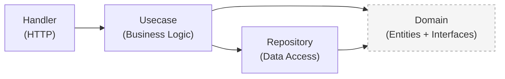

# Copilot Instructions — agent-core-service

## Project Overview

`agent-core-service` is a **Go microservice** (port `8002`) — the **Agent Control Plane** for the OpenClaw multi-agent bot platform. It manages bot state, identity, memory, skills, policies, todos, and heartbeat mechanisms.

- **Language:** Go 1.26
- **Module:** `github.com/minhducta/agent-core-service`
- **Architecture:** Clean Architecture (Domain → Usecase → Repository → Handler)
- **HTTP Framework:** [Fiber v2](https://github.com/gofiber/fiber) (`github.com/gofiber/fiber/v2`)
- **Database:** PostgreSQL 17 via `sqlx` + `lib/pq`
- **Cache:** Redis via `go-redis/v9`
- **Message Broker:** Apache Kafka via `IBM/sarama`
- **Config:** `spf13/viper` reading `config/config.yaml`
- **Logging:** `go.uber.org/zap` (structured JSON logs)
- **Migrations:** `golang-migrate/migrate`
- **UUID:** `google/uuid`
- **ID generation:** UUID v4/v7 via `google/uuid`

---

## Directory Structure

```
cmd/api/main.go          # Entrypoint — wires all dependencies (DI by hand)
config/config.yaml       # Application configuration (server, db, redis, kafka, logger)
internal/
  domain/                # Core layer — entities, interfaces, request/response types, errors, events
  handler/               # Delivery layer — Fiber HTTP handlers + router registration
  middleware/            # Fiber middlewares (CORS, logger, recovery, auth API key)
  mocks/                 # testify/mock implementations of domain interfaces
  repository/            # Data layer — PostgreSQL implementations of domain interfaces
  usecase/               # Business logic layer — orchestrates repos + cache + kafka
migrations/              # SQL migration files (golang-migrate compatible, up/down)
pkg/
  cache/                 # Redis cache client + typed helpers
  config/                # Config loader (viper) + typed structs
  database/              # PostgreSQL connection pool (sqlx wrapper)
  kafka/                 # Kafka sync producer wrapper
  logger/                # Zap logger wrapper
  migration/             # golang-migrate runner
Dockerfile               # Multi-stage build (golang:1.26-alpine → alpine:3.19)
docker-compose.yml       # Local dev stack (app + postgres:17 + redis:7 + zookeeper + kafka)
Makefile                 # All developer commands
```

---

## Clean Architecture Layers



| Layer | Package | Role |
|---|---|---|
| Domain | `internal/domain` | Entities, enums, repository interfaces, request/response structs, error codes, Kafka event types |
| Usecase | `internal/usecase` | Business rules, cache integration, Kafka event publishing, orchestration |
| Repository | `internal/repository` | SQL queries via `sqlx`, implements domain interfaces |
| Handler | `internal/handler` | HTTP parsing, validation, calls usecase, returns JSON |
| Middleware | `internal/middleware` | API Key auth guard, CORS, request logger, panic recovery |
| Infrastructure | `pkg/` | Database, Redis, config, logger, Kafka — injected at `main.go` |

---

## Domains

| Domain | Table | Description |
|---|---|---|
| Bot | `bots` | Core identity: name, role, vibe, emoji, avatar_url, api_key_hash, last_seen_at, status |
| Memory | `bot_memories` | Long-term context: type, content, tags, importance, expires_at |
| Skill | `bot_skills` | Tools & capabilities: name, description, usage_guide |
| Policy | `bot_policies` | Permissions: action, effect (ALLOW/DENY), conditions (jsonb) |
| Todo | `todos` | Tasks: title, description, status, priority, result, due_date, dependency_id |
| TodoChecklistItem | `todo_checklist_items` | Checklist: content, is_checked, order_index |
| Heartbeat | `heartbeats` | Audit log: bot_id, status, metadata (jsonb) |

---

## API Routes

### Public Routes (no auth)
| Method | Path | Description |
|---|---|---|
| GET | `/health` | Liveness probe |
| GET | `/ready` | Readiness probe |

### Protected Routes (API Key required)
| Method | Path | Description |
|---|---|---|
| GET | `/v1/me` | Bot profile + ref_links |
| GET | `/v1/me/identity` | Bot identity details |
| GET | `/v1/me/bootstrap` | Full context dump for startup cache |
| GET | `/v1/me/memories` | List bot memories |
| POST | `/v1/me/memories` | Create memory |
| DELETE | `/v1/me/memories/:id` | Delete memory |
| GET | `/v1/me/skills` | List skills |
| GET | `/v1/me/policies` | List policies |
| GET | `/v1/todos` | List assigned todos |
| PATCH | `/v1/todos/:id` | Update todo status/result |
| GET | `/v1/todos/:id/checklist` | Get checklist items |
| PATCH | `/v1/todos/:id/checklist/:item_id` | Check/uncheck item |
| POST | `/v1/heartbeat` | Bot ping (returns pending_commands + cache_invalidations) |
| GET | `/v1/heartbeat/status` | All bots status overview |

---

## Authentication

- Each bot has a unique API Key (static Bearer Token) assigned at creation
- Middleware extracts `Bearer <token>` → SHA-256 hash → lookup `bots` table → set `botID` in `fiber.Locals`
- All `/v1/*` endpoints require valid API Key
- Multi-tenancy: bot can only access its own data

---

## Heartbeat Flow

```
Bot startup:
  GET /v1/me/bootstrap → load full context into local in-memory cache

Every 60s:
  POST /v1/heartbeat → { status, current_task, metrics }
  ← { pending_commands, cache_invalidations, next_ping_in_seconds }

On cache_invalidations:
  Bot reloads specified domains (skills, policies, etc.)

On write-back:
  PATCH /v1/todos/:id → { status: "completed", result: "..." }
  POST /v1/me/memories → { type, content, importance }
```

---

## Error Handling Convention

- Error codes defined in `internal/domain/error.go`
- Response format: `{"error": {"code": "...", "message": "..."}}`
- Never expose raw DB errors to HTTP response

## Key Conventions

- UUIDs for all primary keys (`google/uuid`)
- `botID` stored in `fiber.Locals` by auth middleware after API Key validation
- Cache keys: `agent:<entity>:<id>` pattern
- Kafka events published for key state changes (bot status, todo completed, memory created)
- Dependency injection done manually in `cmd/api/main.go` — no DI framework
- All SQL queries use parameterised statements
- API Key stored as SHA-256 hash — never plaintext

## Adding a New Endpoint

1. `internal/domain/` — Add entity, DTOs, repository interface method
2. `internal/repository/` — Implement SQL query
3. `migrations/` — Add `NNN_description.up.sql` / `.down.sql` if schema changes
4. `internal/usecase/` — Business logic
5. `internal/handler/` — HTTP handler + register route in `router.go`
6. `*_test.go` — Unit tests
