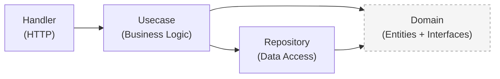

# Copilot Instructions — agent-core-service

## Project Overview

`agent-core-service` is a **Go microservice** (port `8002`) — the core backend for managing AI bot identities, memories, skills, policies, todos, and heartbeat monitoring. It provides a REST API that bots authenticate against using API keys.

- **Language:** Go 1.26
- **Module:** `github.com/minhducta/agent-core-service`
- **Architecture:** Clean Architecture (Domain → Usecase → Repository/Handler)
- **HTTP Framework:** [Fiber v2](https://github.com/gofiber/fiber) (`github.com/gofiber/fiber/v2`)
- **Database:** PostgreSQL via `sqlx` + `lib/pq`
- **Cache:** Redis via `go-redis/v9`
- **Message Broker:** Apache Kafka via `IBM/sarama`
- **Config:** `spf13/viper` reading `config/config.yaml`
- **Logging:** `go.uber.org/zap` (structured JSON logs)
- **ID generation:** `google/uuid`

---

## Directory Structure

```
cmd/api/main.go          # Entrypoint — wires all dependencies (DI by hand)
config/config.yaml       # Application configuration (server, db, redis, cache, kafka, logger, pagination, migration)
internal/
  domain/                # Core layer — entities, interfaces, request/response types, errors, events
  handler/               # Delivery layer — Fiber HTTP handlers + router registration
  middleware/            # Fiber middlewares (CORS, logger, recovery, API key auth)
  mocks/                 # testify/mock implementations of domain interfaces
  repository/            # Data layer — PostgreSQL implementations of domain interfaces
  usecase/               # Business logic layer — orchestrates repos + cache + kafka
migrations/              # SQL migration files (golang-migrate compatible, up/down)
pkg/
  cache/                 # Redis cache client + typed helpers (bots, API keys, memories)
  config/                # Config loader (viper) + typed structs
  database/              # PostgreSQL connection pool (sqlx wrapper)
  kafka/                 # Kafka sync producer wrapper
  logger/                # Zap logger wrapper + request logger middleware
  migration/             # golang-migrate runner
Dockerfile               # Multi-stage build (golang:1.26-alpine → alpine:3.19)
docker-compose.yml       # Local dev stack (app + postgres + redis + zookeeper + kafka)
Makefile                 # All developer commands
```

---

## Clean Architecture Layers

The dependency flow is strictly **inward** — outer layers depend on inner ones, never the reverse.



| Layer | Package | Role |
|---|---|---|
| Domain | `internal/domain` | Entities, enums, repository interfaces, request/response structs, error codes, Kafka event types |
| Usecase | `internal/usecase` | Business rules, cache integration, Kafka event publishing, orchestration |
| Repository | `internal/repository` | SQL queries via `sqlx`, implements domain interfaces |
| Handler | `internal/handler` | HTTP parsing, validation, calls usecase, returns JSON |
| Middleware | `internal/middleware` | API Key auth guard, CORS, request logger, panic recovery |
| Infrastructure | `pkg/` | Database, Redis, config, logger, Kafka — injected at `main.go` |

---

## API Routes

### Public Routes (no auth required)
| Method | Path | Handler | Description |
|---|---|---|---|
| GET | `/health` | `HealthHandler.HealthCheck` | Liveness probe |
| GET | `/ready` | `HealthHandler.Ready` | Readiness probe |

### Protected Routes (API Key required)
| Method | Path | Handler | Description |
|---|---|---|---|
| GET | `/v1/me` | `BotHandler.GetProfile` | Bot profile + ref_links |
| GET | `/v1/me/identity` | `BotHandler.GetIdentity` | Minimal bot identity |
| GET | `/v1/me/bootstrap` | `BotHandler.GetBootstrap` | Full context dump |
| GET | `/v1/me/memories` | `MemoryHandler.ListMemories` | List bot memories |
| POST | `/v1/me/memories` | `MemoryHandler.CreateMemory` | Create a memory |
| DELETE | `/v1/me/memories/:id` | `MemoryHandler.DeleteMemory` | Delete a memory |
| GET | `/v1/me/skills` | `SkillHandler.ListSkills` | List bot skills |
| GET | `/v1/me/policies` | `PolicyHandler.ListPolicies` | List bot policies |
| GET | `/v1/todos` | `TodoHandler.ListTodos` | List todos (paginated) |
| PATCH | `/v1/todos/:id` | `TodoHandler.UpdateTodo` | Update a todo |
| GET | `/v1/todos/:id/checklist` | `TodoHandler.GetChecklist` | Get checklist items |
| PATCH | `/v1/todos/:id/checklist/:item_id` | `TodoHandler.UpdateChecklistItem` | Update checklist item |
| POST | `/v1/heartbeat` | `HeartbeatHandler.RecordHeartbeat` | Record heartbeat |
| GET | `/v1/heartbeat/status` | `HeartbeatHandler.GetHeartbeatStatus` | Get heartbeat status |

---

## Makefile Commands

| Command | What it does |
|---|---|
| `make build` | Compiles binary to `./bin/agent-core-service` with `-ldflags="-s -w"` |
| `make run` | Builds then runs with `config/config.yaml` |
| `make dev` | Hot reload via [air](https://github.com/air-verse/air) |
| `make test` | `go test ./... -v -cover` |
| `make test-coverage` | Tests with coverage report |
| `make tidy` | `go mod tidy` |
| `make deps` | `go mod download` |
| `make docker-build` | Builds Docker image `agent-core-service:latest` |
| `make docker-up` | Starts all services via `docker compose up -d` |
| `make docker-down` | Stops all services |
| `make docker-logs` | Tails app container logs |
| `make docker-reset` | Wipes volumes and restarts everything fresh |

> Always run `make deps` or `go mod tidy` after changing `go.mod`.

---

## Dockerfile — Multi-stage Build

1. **Builder** (`golang:1.26-alpine`): Downloads deps, then builds a statically-linked binary (`CGO_ENABLED=0 GOOS=linux -ldflags="-s -w"`).
2. **Runner** (`alpine:3.19`): Copies only the binary + `config/config.yaml` + `migrations/`. Exposes port `8002`.

---

## Adding or Modifying an API Endpoint

When adding a new endpoint, touch files in this order:

1. **`internal/domain/`** — Add/update entity structs, request/response types, enums, and the repository interface method.
2. **`internal/repository/`** — Implement the new repository method (raw SQL via `sqlx`).
3. **`migrations/`** — Add a new `NNN_description.up.sql` / `.down.sql` pair if schema changes are needed.
4. **`internal/usecase/`** — Implement business logic; inject repo + cache + logger + kafka producer.
5. **`internal/handler/`** — Add the handler method; register the route in `router.go`.
6. **`internal/mocks/`** — Update mock implementations if repository interfaces changed.
7. **`*_test.go`** — Add corresponding unit tests.

---

## Recommended Libraries (already in use)

| Purpose | Library |
|---|---|
| HTTP server | `github.com/gofiber/fiber/v2` |
| SQL client | `github.com/jmoiron/sqlx` + `github.com/lib/pq` |
| Redis | `github.com/redis/go-redis/v9` |
| Kafka | `github.com/IBM/sarama` |
| UUID | `github.com/google/uuid` |
| Config | `github.com/spf13/viper` |
| Logging | `go.uber.org/zap` |

For new needs, prefer libraries already in `go.mod`. Only add new dependencies when strictly necessary; run `go mod tidy` afterwards.

---

## Error Handling Convention

- Error codes are defined as constants in `internal/domain/error.go` (e.g., `ErrCodeValidation`, `ErrCodeNotFound`, `ErrCodeUnauthorized`, `ErrCodeForbidden`, `ErrCodeInternal`).
- Handlers return structured JSON: `{"error": {"code": "...", "message": "..."}}`.
- Usecases return Go errors; handlers map them to HTTP status codes.
- Never expose raw database errors to the HTTP response.

---

## Key Conventions

- UUIDs are used for all primary keys.
- Bots authenticate via **API Key** (SHA-256 hash stored in DB). The raw key is sent as `Bearer <key>` in the `Authorization` header.
- The `botId` is stored in `fiber.Locals` by the auth middleware after API key validation.
- Cache keys follow the pattern `agent:<entity>:<identifier>` (e.g., `agent:bot:<uuid>`).
- Kafka events are published for key actions: bot seen, memory created/deleted, todo updated/completed, heartbeat received.
- Dependency injection is done **manually** in `cmd/api/main.go` — no DI framework.
- Configuration is loaded once at startup via `pkg/config/config.go`.
- All database queries must use parameterised statements (no string interpolation).

---

## Go Development Best Practices

Follow idiomatic Go practices based on [Effective Go](https://go.dev/doc/effective_go) and [Go Code Review Comments](https://go.dev/wiki/CodeReviewComments).

### Code Style

- Write simple, clear, and idiomatic Go code
- Favor clarity and simplicity over cleverness
- Keep the happy path left-aligned (minimize indentation)
- Return early to reduce nesting
- Make the zero value useful
- Write self-documenting code with clear, descriptive names
- Use `gofmt` and `goimports` to format code
- Avoid emoji in code and comments

### Naming Conventions

- Use mixedCaps (camelCase) rather than underscores
- Keep names short but descriptive
- Exported names start with a capital letter
- Avoid stuttering (e.g., avoid `http.HTTPServer`, prefer `http.Server`)
- Package names: lowercase, single-word, no underscores

### Package Declaration Rules (CRITICAL)

- **NEVER duplicate `package` declarations** — each Go file must have exactly ONE `package` line
- When editing an existing `.go` file, **PRESERVE** the existing `package` declaration
- When creating a new `.go` file, check what package name other files in the directory use

### Error Handling

- Check errors immediately after the function call
- Don't ignore errors using `_` unless documented why
- Wrap errors with context using `fmt.Errorf` with `%w` verb
- Use `errors.Is` and `errors.As` for error checking
- Keep error messages lowercase and don't end with punctuation

### Interfaces

- Accept interfaces, return concrete types
- Keep interfaces small (1-3 methods is ideal)
- Define interfaces close to where they're used
- Name interfaces with -er suffix when possible (e.g., `Reader`, `Writer`)

### Concurrency

- Always know how a goroutine will exit
- Use `sync.WaitGroup` or channels to wait for goroutines
- Use channels to communicate between goroutines
- Use `sync.Mutex` for protecting shared state
- Keep critical sections small

### Testing

- Use table-driven tests for multiple test cases
- Name tests descriptively using `Test_functionName_scenario`
- Use subtests with `t.Run` for better organization
- Mark helper functions with `t.Helper()`
- Clean up resources using `t.Cleanup()`

### Security

- Validate all external input
- Use parameterised statements for SQL queries
- Use crypto/rand for random number generation
- Use TLS for network communication

---

## Unit Testing Guidelines

### General Principles

- **Always test new code** — whenever new functions, methods, or handlers are generated, create corresponding unit tests immediately.
- **High coverage** — aim for > 80%. Cover happy paths, edge cases, and error states.
- **Table-driven tests** — all tests MUST use the Go table-driven testing pattern (slice of anonymous structs with `t.Run`).
- **Assertions** — use `github.com/stretchr/testify/assert` and `github.com/stretchr/testify/require` instead of raw `if err != nil`.

### Mocking Strategy

| Dependency | Library |
|---|---|
| Domain interfaces (repos) | `github.com/stretchr/testify/mock` |
| SQL Database | `github.com/DATA-DOG/go-sqlmock` |
| Redis | `github.com/go-redis/redismock/v9` |
| Fiber handlers | `app.Test(httptest.NewRequest(...))` |

### Layer-Specific Rules

- **Repository tests**: use `go-sqlmock`; never connect to a real database.
- **Usecase tests**: mock repos via `testify/mock`; pass `nil` for cache and Kafka producer; use a real logger.
- **Handler tests**: create `fiber.New()` app, register the route, inject mocked usecase, test via `app.Test(req, -1)`.
- **Domain tests**: test pure helper methods directly; no mocks needed.
