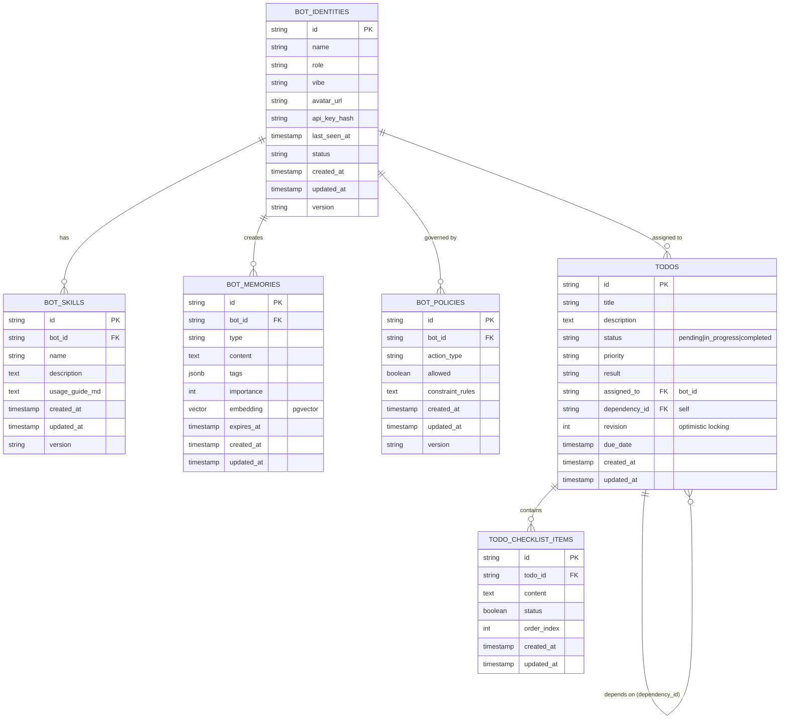

# Database ERD - Agent Core Service

```mermaid
erDiagram
    BOT_IDENTITIES ||--o{ BOT_SKILLS : "has"
    BOT_IDENTITIES ||--o{ BOT_MEMORIES : "creates"
    BOT_IDENTITIES ||--o{ BOT_POLICIES : "governed by"
    BOT_IDENTITIES ||--o{ TODOS : "assigned to"
    TODOS ||--o{ TODO_CHECKLIST_ITEMS : "contains"
    TODOS ||--o{ TODOS : "depends on (dependency_id)"

    BOT_IDENTITIES {
        string id PK
        string name
        string role
        string vibe
        string avatar_url
        string api_key_hash
        timestamp last_seen_at
        string status
        timestamp created_at
        timestamp updated_at
        string version
    }

    BOT_SKILLS {
        string id PK
        string bot_id FK
        string name
        text description
        text usage_guide_md
        timestamp created_at
        timestamp updated_at
        string version
    }

    BOT_MEMORIES {
        string id PK
        string bot_id FK
        string type
        text content
        jsonb tags
        int importance
        vector embedding "pgvector"
        timestamp expires_at
        timestamp created_at
        timestamp updated_at
    }

    BOT_POLICIES {
        string id PK
        string bot_id FK
        string action_type
        boolean allowed
        text constraint_rules
        timestamp created_at
        timestamp updated_at
        string version
    }

    TODOS {
        string id PK
        string title
        text description
        string status "pending|in_progress|completed"
        string priority
        string result
        string assigned_to FK "bot_id"
        string dependency_id FK "self"
        int revision "optimistic locking"
        timestamp due_date
        timestamp created_at
        timestamp updated_at
    }

    TODO_CHECKLIST_ITEMS {
        string id PK
        string todo_id FK
        text content
        boolean status
        int order_index
        timestamp created_at
        timestamp updated_at
    }
```
